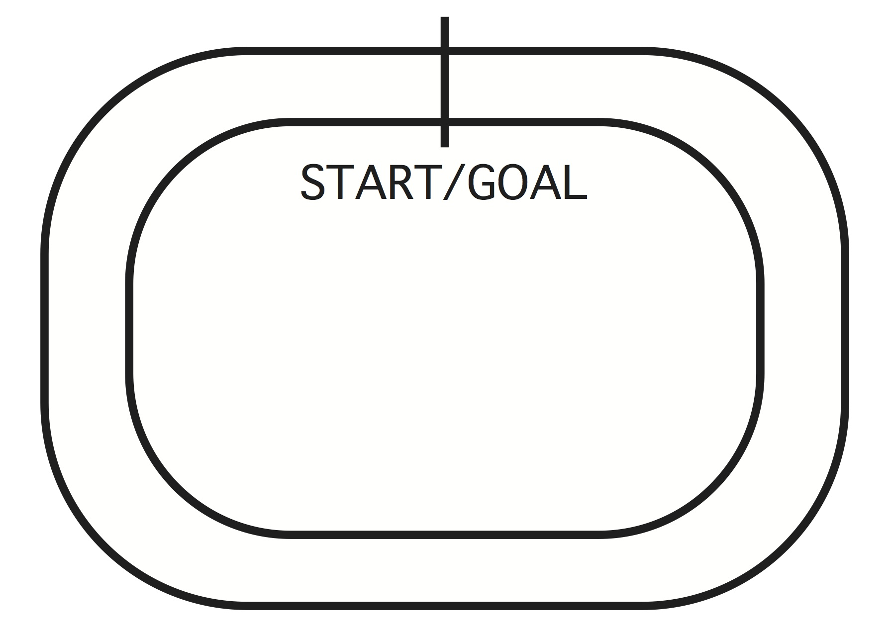
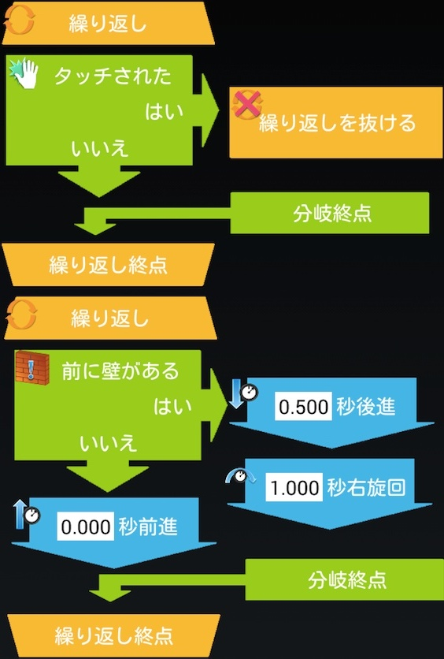

PILEプログラミング入門教育カリキュラム
===

- 初版 2014.09.06
- 更新 2016.12.16

---

*目次*

<!-- START doctoc generated TOC please keep comment here to allow auto update -->
<!-- DON'T EDIT THIS SECTION, INSTEAD RE-RUN doctoc TO UPDATE -->

- [はじめに](#%E3%81%AF%E3%81%98%E3%82%81%E3%81%AB)
- [必要なもの](#%E5%BF%85%E8%A6%81%E3%81%AA%E3%82%82%E3%81%AE)
- [教えたいプログラムの最も基本的な要素](#%E6%95%99%E3%81%88%E3%81%9F%E3%81%84%E3%83%97%E3%83%AD%E3%82%B0%E3%83%A9%E3%83%A0%E3%81%AE%E6%9C%80%E3%82%82%E5%9F%BA%E6%9C%AC%E7%9A%84%E3%81%AA%E8%A6%81%E7%B4%A0)
- [学習に入る前に](#%E5%AD%A6%E7%BF%92%E3%81%AB%E5%85%A5%E3%82%8B%E5%89%8D%E3%81%AB)
  - [プログラム / プログラミング とは？](#%E3%83%97%E3%83%AD%E3%82%B0%E3%83%A9%E3%83%A0--%E3%83%97%E3%83%AD%E3%82%B0%E3%83%A9%E3%83%9F%E3%83%B3%E3%82%B0-%E3%81%A8%E3%81%AF)
- [カリキュラム](#%E3%82%AB%E3%83%AA%E3%82%AD%E3%83%A5%E3%83%A9%E3%83%A0)
  - [勉強を始める前の準備](#%E5%8B%89%E5%BC%B7%E3%82%92%E5%A7%8B%E3%82%81%E3%82%8B%E5%89%8D%E3%81%AE%E6%BA%96%E5%82%99)
    - [準備](#%E6%BA%96%E5%82%99)
    - [初めてのプログラミング](#%E5%88%9D%E3%82%81%E3%81%A6%E3%81%AE%E3%83%97%E3%83%AD%E3%82%B0%E3%83%A9%E3%83%9F%E3%83%B3%E3%82%B0)
  - [順次 (じゅんじ) 命令](#%E9%A0%86%E6%AC%A1-%E3%81%98%E3%82%85%E3%82%93%E3%81%98-%E5%91%BD%E4%BB%A4)
    - [言葉の意味](#%E8%A8%80%E8%91%89%E3%81%AE%E6%84%8F%E5%91%B3)
    - [教えてほしいこと](#%E6%95%99%E3%81%88%E3%81%A6%E3%81%BB%E3%81%97%E3%81%84%E3%81%93%E3%81%A8)
    - [演習課題](#%E6%BC%94%E7%BF%92%E8%AA%B2%E9%A1%8C)
    - [発展課題](#%E7%99%BA%E5%B1%95%E8%AA%B2%E9%A1%8C)
  - [繰り返し (くりかえし) 命令](#%E7%B9%B0%E3%82%8A%E8%BF%94%E3%81%97-%E3%81%8F%E3%82%8A%E3%81%8B%E3%81%88%E3%81%97-%E5%91%BD%E4%BB%A4)
    - [言葉の意味](#%E8%A8%80%E8%91%89%E3%81%AE%E6%84%8F%E5%91%B3-1)
    - [教えてほしいこと](#%E6%95%99%E3%81%88%E3%81%A6%E3%81%BB%E3%81%97%E3%81%84%E3%81%93%E3%81%A8-1)
    - [演習課題](#%E6%BC%94%E7%BF%92%E8%AA%B2%E9%A1%8C-1)
    - [発展課題](#%E7%99%BA%E5%B1%95%E8%AA%B2%E9%A1%8C-1)
  - [分岐 (ぶんき) 命令](#%E5%88%86%E5%B2%90-%E3%81%B6%E3%82%93%E3%81%8D-%E5%91%BD%E4%BB%A4)
    - [言葉の意味](#%E8%A8%80%E8%91%89%E3%81%AE%E6%84%8F%E5%91%B3-2)
    - [教えてほしいこと](#%E6%95%99%E3%81%88%E3%81%A6%E3%81%BB%E3%81%97%E3%81%84%E3%81%93%E3%81%A8-2)
    - [演習課題](#%E6%BC%94%E7%BF%92%E8%AA%B2%E9%A1%8C-2)
    - [発展課題](#%E7%99%BA%E5%B1%95%E8%AA%B2%E9%A1%8C-2)
  - [総合課題 - ライントレース -](#%E7%B7%8F%E5%90%88%E8%AA%B2%E9%A1%8C---%E3%83%A9%E3%82%A4%E3%83%B3%E3%83%88%E3%83%AC%E3%83%BC%E3%82%B9--)
    - [教えてほしいこと](#%E6%95%99%E3%81%88%E3%81%A6%E3%81%BB%E3%81%97%E3%81%84%E3%81%93%E3%81%A8-3)
    - [演習課題](#%E6%BC%94%E7%BF%92%E8%AA%B2%E9%A1%8C-3)
    - [発展課題](#%E7%99%BA%E5%B1%95%E8%AA%B2%E9%A1%8C-3)
- [課題の解答例](#%E8%AA%B2%E9%A1%8C%E3%81%AE%E8%A7%A3%E7%AD%94%E4%BE%8B)
  - [順次](#%E9%A0%86%E6%AC%A1)
    - [演習課題](#%E6%BC%94%E7%BF%92%E8%AA%B2%E9%A1%8C-4)
    - [発展課題](#%E7%99%BA%E5%B1%95%E8%AA%B2%E9%A1%8C-4)
  - [繰り返し](#%E7%B9%B0%E3%82%8A%E8%BF%94%E3%81%97)
    - [演習課題](#%E6%BC%94%E7%BF%92%E8%AA%B2%E9%A1%8C-5)
    - [発展課題](#%E7%99%BA%E5%B1%95%E8%AA%B2%E9%A1%8C-5)
  - [分岐](#%E5%88%86%E5%B2%90)
    - [演習課題](#%E6%BC%94%E7%BF%92%E8%AA%B2%E9%A1%8C-6)
    - [発展課題](#%E7%99%BA%E5%B1%95%E8%AA%B2%E9%A1%8C-6)
  - [総合課題](#%E7%B7%8F%E5%90%88%E8%AA%B2%E9%A1%8C)
    - [演習課題](#%E6%BC%94%E7%BF%92%E8%AA%B2%E9%A1%8C-7)
    - [発展課題](#%E7%99%BA%E5%B1%95%E8%AA%B2%E9%A1%8C-7)
- [著作権について](#%E8%91%97%E4%BD%9C%E6%A8%A9%E3%81%AB%E3%81%A4%E3%81%84%E3%81%A6)
- [お問い合わせ先](#%E3%81%8A%E5%95%8F%E3%81%84%E5%90%88%E3%82%8F%E3%81%9B%E5%85%88)

<!-- END doctoc generated TOC please keep comment here to allow auto update -->

# はじめに
このドキュメントは、PILE のアプリケーションを用いたプログラミング入門教育用のカリキュラムです。このドキュメントをもとに、教育者の方々が小中学生にプログラミングを通して「順序立てて考える力」、「ものを作ることの楽しさ」を効果的に教えられることを期待しています。
また、教育者にプログラミング経験がなくとも、このドキュメントを通して基礎的な知識を獲得できるようになっています。

# 必要なもの
このドキュメントを用いたカリキュラムを実施するためには、PILE が開発したアプリケーションとハードウェアが必要になります。これらの使い方は、本ドキュメントでは扱いません。それぞれの取扱説明書をご覧ください。

<!-- ここに補足情報が必要。LEGO のこととか -->

# 教えたいプログラムの最も基本的な要素
このカリキュラムで教えるプログラムの最も基本的な構成要素は、「順次 (じゅんじ) 」、「繰り返し (くりかえし) 」、「分岐 (ぶんき) 」の3つです。それぞれの詳細については、カリキュラムの中で学んでください。基本的な概念を表した図を下記に示しておきます。

# 学習に入る前に
## プログラム / プログラミング とは？

<!-- 補足資料 -->

# カリキュラム
このドキュメントで行う学習では、課題を少しづつクリアしていくことで習熟度を上げていく方法をとります。プログラムの基本構造は「順次」、「繰り返し」、「分岐」の 3 つです。これらを組み合わせれば、どのようなプログラムでも作成できます。子供たちには、この 3 つの基本構造を、1 つずつ課題を通して学ばせます。

各章を 1 回 1 時間程度かけて教えることを想定しています。各章は、以下の項目に従って構成されています。

- 言葉の意味

新しく習う言葉の意味を説明しています。この章は、主に教育者側の基礎知識を補うことを目的としています。

- 教えてほしいこと

子供たちに教える方法を示しています。主に、「言葉の意味」の章で身につけた知識を子供たちに伝えるための方法やストーリーを提示しています。

- 演習課題

各章で習った内容を実際にプログラムにすることで、習熟度をあげるための章です。

- 発展課題

演習課題を終えて、余裕がある子どものための追加課題です。

## 勉強を始める前の準備
### 準備
アプリケーションとハードウェアの接続を行います。接続は Bluetooth を使った無線通信です。アプリケーションとロボットをペアリング済みの状態にしておいてください。

### 初めてのプログラミング
初めてのプログラムは、最も簡単な「前進」をするだけのプログラムです。非常に簡単なプログラムを作成するだけで、ロボットを動作させることができるという驚きを体験していただきます。
この一番簡単なプログラムで、全員の準備が整ったことを確認します。

## 順次 (じゅんじ) 命令

### 言葉の意味
順次命令は、プログラムの構造の中でも最も基礎的なもので、「順番に言われたことを実行する」という命令です。
例えば、ロボットに「前進」と指令を出し、その後に「後進」と指令を出します。すると、その命令に従ってまず前進を始め。前進が終わったら後進を始めます。このように、実際に何をするかを示し、それらを順番に実行するというのが (順番に次の命令を実行するから) 順次命令です。

### 教えてほしいこと
順次命令の概念は非常に簡単ですので、前述のように、「前進してから後進する」などの例を使って、プログラムは処理の流れを順番に記述するものだと教えればよいでしょう。PILE の提供するソフトウェア上では、ブロックを上から順に並べることで、順番に実行されていくことを理解させることができます。演習課題では、課題を与え、その課題をクリアするための処理を順序立てて考えさせることができるとよいでしょう。

### 演習課題
図のようなコースを用いて、スタートから折り返し地点まで進み、そこで旋回してから戻ってきて止まるというものです。順次命令のみを用いてこの課題をクリアしましょう。

### 発展課題
順次命令のみを用いて四角形を描くようにロボットを動作させてみましょう。

## 繰り返し (くりかえし) 命令

### 言葉の意味
繰り返し命令は、選択した命令を複数回繰り返すものです。例えば、「1 秒前進」と「1 秒後進」を繰り返し命令で指定することで「1 秒前進と 1 秒後進を 3 回繰り返す」というような命令を作ることが出来ます。PILE が提供する教材では、繰り返しの開始ブロックと終了ブロックで繰り返したい命令を挟むことで繰り返したい命令を指定します。順次命令とは違い、実際にこの命令自体で何かを行うものではなく、プログラムの流れを変更する命令です。この命令がないと、赤と青を「無限に」繰り返す信号機などのプログラミングができません。

### 教えてほしいこと
繰り返し命令は、実際に処理を行うわけではないですが、同じことを何度も記述することなくプログラムが作成できます。これも順次命令の時と同じように例を示しながら紹介すると良いでしょう。PILE が提供するソフトウェアでは、「回数付きの繰り返し」と「ずっと繰り返す」という二つの繰り返し命令を用意しています。回数付きの繰り返しを使わせて、回数を数えながら本当に指定した回数繰り返しているかを確認させると繰り返し命令を理解しやすいでしょう。

### 演習課題
図のようなコースを用いて、ロボットがスタートからゴールまで一周するようなプログラムを作成しましょう。使用しても良いのは、順次命令と繰り返し命令のみです。
ヒント：コースを半分で区切ると全く同じ形をしていますね。
2 回繰り返すことで処理が短く記述できることを示すとよいでしょう。

### 発展課題
順次命令での発展課題を、繰り返し命令を使って作成しましょう。

## 分岐 (ぶんき) 命令

### 言葉の意味
分岐命令は、条件によって実行する命令を選ぶ命令です。例えば、「壁が前にあるか」などの条件を指定し、壁が前にあるときに実行する命令と、壁が前にないときに実行する命令を指定することで処理の流れを分岐させることができます。この命令も繰り返し命令と同じで、この命令自体で何かを行うものではなく、プログラムの流れを変更する命令です。分岐命令は、プログラムの多様性を生み出すためになくてはならない命令です。

### 教えてほしいこと
他の命令と同様に、例を示しながら説明するとよいでしょう。前述の壁の例でも良いですし、「雨が降っていたら傘を持っていく、降っていなかったら犬の散歩に行く」など、子供にあった例を示すとよいでしょう。

ロボットを操作するプログラムを作る際には、パソコン上で動くプログラムと異なることに注意する必要があります。それは、プログラムを「ずっと繰り返す」で挟んでいないと、プログラムの実行がすぐ終わってしまうことです。例えば、エアコンに現在の「気温が設定よりも低い」という条件で分岐をさせようとしたときは、このチェックは定期的にずっと行ってほしいですよね。今回用いているロボットでも、「前に壁がある」という条件で分岐を行いたい場合、「ずっと繰り返す」で挟んでいないと、1 回だけ「今、ロボットの前に壁があるか？」のチェックが行われて終わってしまいます。このことは、繰り返し命令を使わない簡単なプログラムを作らせて、プログラムがすぐに終わってしまうことを見せればわかってもらえると思います *これを一つの演習課題としてわけたほうがいいかもしれません*。

ロボットのプログラムを作る際に、分岐命令で注意することがもう 1 つあります。それは、分岐命令を実行するタイミングです。分岐命令を「ずっと繰り返す」で挟むことで、例えば「壁が前にある」という命令があったとき、前に壁があるときの命令とないときの命令のどちらかが実行されます。そして、次に分岐命令の判定があるのは、そのどちらかの命令が終わった時です。つまり、分岐命令によるチェックを頻繁に行いたい場合は、起こりやすい命令の実行時間を短くしておく必要があります。

この回では、この少し難しい概念を教える必要があり、そのためのストーリーを考える必要があります。例えば、「横断歩道で信号が変わるのを確認していて、変わらない間は友達と話しているが、信号が変わったら横断歩道を渡る」という状況を提示して、信号が変わったらすぐ渡るようにするためには、友達と話す時間を細かくして信号を何回も繰り返して見なければならないというような例を示す必要があります *この例が適切であるかは議論の余地があります*。

演習課題はこれらのことが理解できさえすれば、比較的容易なものを用意しています。

### 演習課題
タッチされたら走りだして、前に壁が来たら止まるプログラムを作成してみましょう。この課題では、コースは使いません。順次命令と繰り返し命令、分岐命令の全てを組み合わせてみましょう。繰り返しから抜ける命令を使ってみましょう。

### 発展課題
演習課題で、壁が来たら止まるのではなく、少し後進して右旋回をしてまた壁があるまで進み始めるようなプログラムを作成してみましょう。

## 総合課題 - ライントレース -
総合課題は、前述の「順次」、「繰り返し」、「分岐」を全て用いた難度の高い課題です。用意したコースの線をたどって、一周することができたら課題達成です。

### 教えてほしいこと
総合課題は、今までの課題の総復習を兼ねています。ここでは、比較的難しい課題を順序立てて考えて解くという力を養います。どのような順次命令、分岐命令、繰り返し命令が必要かを考えさせて、解かせましょう。

### 演習課題
図のようなコースを用いて、ロボットがスタートからゴールまでラインを辿りながら、一周するプログラムを作成しましょう。順次命令と繰り返し命令、分岐命令の全てを使って構いません。

### 発展課題
演習課題を光センサ1つでクリアするにはどうしたら良いか考えてみましょう。そのプログラムは必ずゴールできるでしょうか。
ヒント：光センサが1つとなると、線のどちらに出るかがわかりません。この事を考えると、運が良ければゴールできますが、回転が大きすぎてしまったりするとゴールできない場合があることがわかります。

# 課題の解答例
秒数などは個体差や地面によって異なります。ここでは、比較的わかりやすい値を提示しました。

## 順次
### 演習課題

### 発展課題

## 繰り返し
### 演習課題

### 発展課題

## 分岐
### 演習課題

### 発展課題

## 総合課題
### 演習課題

### 発展課題
難しい課題です。ヒントにも示しましたが、線のどちら側にでるかわからないところが問題でしょう。
これをクリアするには、逆転の発想が必要です。それは「必ず左に出るようにする」という方法です。
タイヤの出力設定ができる命令が順次命令にあります。これを用いてタイヤの出力を右だけ強くしておきます。
すると、前進の際に必ず左に出るように進むので、線から出たら右旋回をするようにすれば良くなります。

# 著作権について
 PILE Project を著作者とするこの 作品 は <a rel="license" href="http://creativecommons.org/licenses/by-nc-sa/4.0/">クリエイティブ・コモンズの 表示 - 非営利 - 継承 4.0 国際 ライセンス</a>で提供されています。
商用での利用を検討される場合は， <info@pileproject.com> までご連絡ください。

# お問い合わせ先
この資料についてのご質問やトラブルは以下にご連絡ください。

E-mail: <pile-dev@googlegroups.com>
